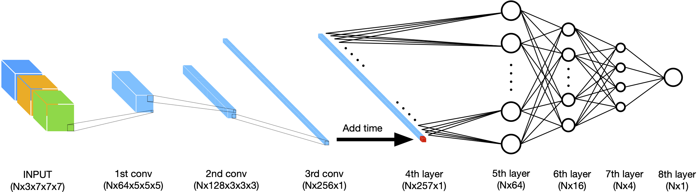

# PINION

**_A featherweight EoR simulation_**

# Goal

This project aims at accelerating radiative transfer simulation with physics informed neural network. For this, a CNN with an additional ODE loss is trained on a $\mbox{C}^2\mbox{-Ray}$ simulation. The end goal is to be able to produce highly detailed large scale simulations at lower computational cost by training on lower scale simulations.

# Network architecture

# Repository structure

At the root, one can find several Python scripts that contain definition of methods and classes that are used in the training. In particular `central_cnn.py` contains the definition of the neural network used in this project.

In the `trainings/` folder, one can find three Jupyter notebooks. Two of them are used to train the neural network, and the last one allows generating the propagating mask used as input from the network.

In the `prediction/` folder, one can find Python scripts to export subvolumes and group them at the end, as well as a typical slurm script to run the whole prediction.

In the `models/` folder, one can find the three trained models used in the paper. Note that to clone these files, one needs the [git-lfs](https://git-lfs.github.com/) addon.

# Installation

This project uses Python3 and the packages are listed in `requirements.txt`. This project was tested a GPU-equipped Linux device running Python 3.9.10.

# What does PINION stands for ?

PINION is the acronym for Physics Informed Neural network for reIONization.

# Links
Pre-print: https://github.com/epfl-radio-astro/PINION
